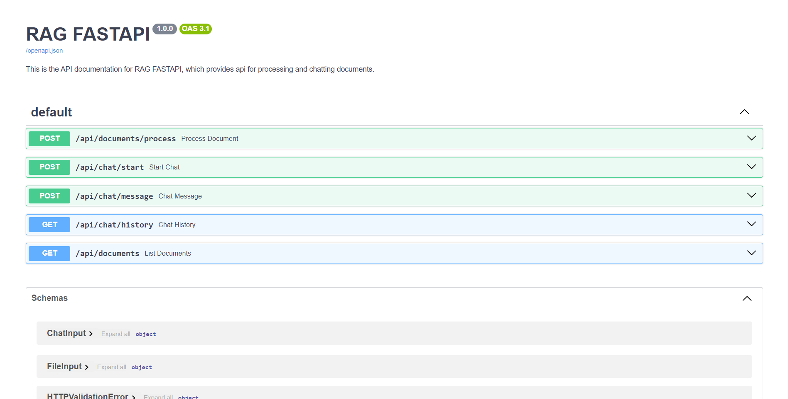
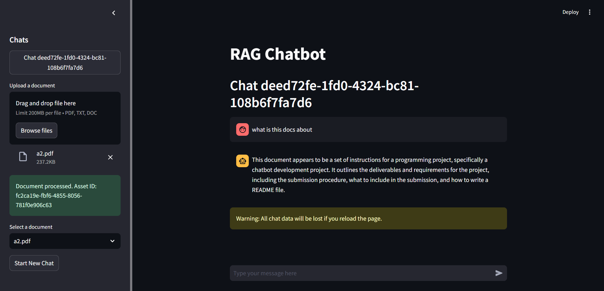

# RAG FASTAPI For Pdf,txt,doc files




## Table of Contents

- [API Documentation](#api-documentation)
- [Setup Instructions](#setup-instructions)
  - [Prerequisites](#prerequisites)
  - [Installation](#installation)
  - [Running the Application](#running-the-application)
  - [Docker Setup](#docker-setup)
- [Potential Improvements](#potential-improvements)
- [Contributing](#contributing)

## API Documentation

The API provides several endpoints for interacting with the application. You can access the detailed API documentation via Postman. To get started:

1. **API DOCS**: check `api-documentation.pdf` file
2. **API Endpoints**:

- **Process Document**
  - **Endpoint**: `POST /api/documents/process`
  - **Input**: File path
  - **Output**: Asset ID
  - **Description**: This endpoint processes the document at the given file path and returns an Asset ID.
- **Start Chat**
  - **Endpoint**: `POST /api/chat/start`
  - **Input**: Asset ID
  - **Output**: Chat thread ID
  - **Description**: This endpoint initiates a chat session using the provided Asset ID and returns a Chat thread ID.
- **Send Chat Message**
  - **Endpoint**: `POST /api/chat/message`
  - **Input**: Chat thread ID, User message
  - **Output**: Agent response (streamed)
  - **Description**: This endpoint sends a user message to the chat thread and streams the agent's response in real-time.
- **Get Chat History**
  - **Endpoint**: `GET /api/chat/history`
  - **Input**: Chat thread ID
  - **Output**: Chat history
  - **Description**: This endpoint retrieves the full history of a chat session using the provided Chat thread ID.

## Setup Instructions

### Prerequisites

Ensure you have the following installed:

- Python 3.x
- pip (Python package manager)
- Docker (for containerized setup)

### Clone

Clone the repository:

```bash
git clone https://github.com/Jayanth-MKV/RAG-fastapi-chroma-langchain-docker.git

cd RAG-fastapi-chroma-langchain-docker
```

### Setting Up a Virtual Environment

It is recommended to use a virtual environment to manage dependencies for your project. Here’s how you can set one up:

1. Navigate to your project directory:

   ```bash
   cd RAG-fastapi-chroma-langchain-docker

   ```
2. Create a virtual environment:

   ```bash
   python -m venv venv

   ```
3. Activate the virtual environment:

   - On macOS and Linux:

     ```bash
     source venv/bin/activate

     ```
   - On Windows:

     ```bash
     ./venv/Scripts/activate

     ```
4. Once activated, your terminal should show the virtual environment name, indicating that you are working inside the virtual environment.

### Installation

1. Install the required Python packages:

   ```bash
   pip install -r requirements.txt
   ```
2. ENV Setup
   create a .env file and replace the api key

   ```
   GROQ_API_KEY = "api-key-here"
   ```

   You can get this from [https://console.groq.com/keys](https://console.groq.com/keys "https://console.groq.com/keys")

### Running the Application

To run the application locally, use the following command:

```bash
python main.py
```

This will start the server on `http://localhost:8000`. You can test the endpoints using at `http://localhost:8000/docs`

You can also run the sample streamlit app using - `streamlit run streamlit.py`

### Docker Setup

To set up and run the application using Docker, follow these steps:

1. **Build the Docker image**:

   ```bash
   docker build -t myapp .
   ```
2. **Run the Docker container**:

   ```bash
   docker run -p 8000:8000 myapp
   ```
3. The application will be accessible at `http://localhost:8000`.

## Potential Improvements

- User authentication and authorization to secure endpoints.
- Adding different formats of data + adding connectors to drive, notion, dropbox, etc..
- Improving file handling and storing.
- Add unit and integration tests to ensure code reliability. Also the stress test.
- Scaling Vector Database like quadrant/pinecone
- Implementing the rag evaluation pipeline
- Experimenting differnt embedding models and parameters
- Combining traditional rag with graph db - hybrid rag improves the results
- Agentic approach to encounter hallucinations

## Contributing

Contributions are welcome! Please feel free to submit a Pull Request or open an Issue to discuss improvements or fixes.
